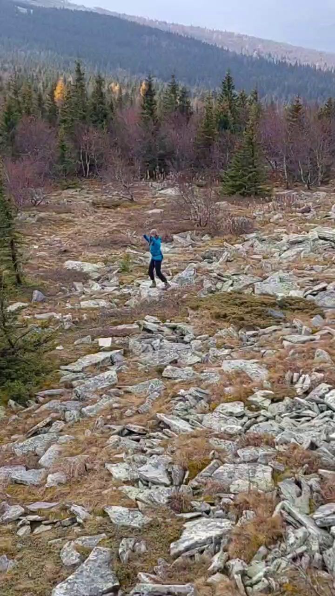
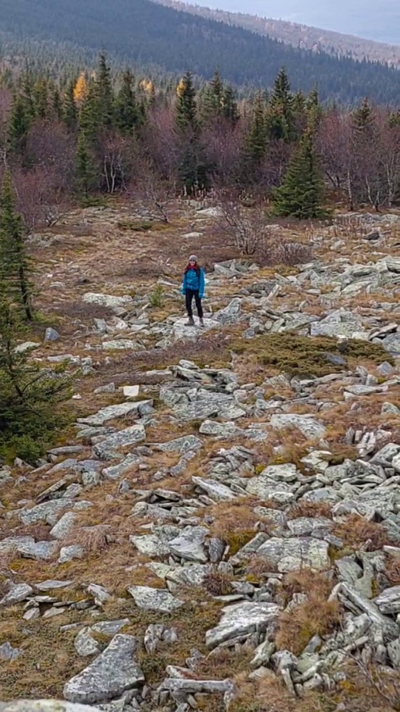

# Video to text

## Work with repo

### Preparing the environment for work
    
    poetry shell
    poetry install
    
   
### Transformer
    python inference_transformer

## inference for Slowfast Net
 https://colab.research.google.com/github/vaib-saxena/Slow-Fast-pytorch-implementation/blob/master/slow_fast.ipynb

## Result  
## image capturing

General: ['path', 'dirt', 'person', 'lush', 'standing', 'frisbeea', 'mountainsa', 'boy', 'hillside', 'backpack', 'animalsa', 'hillsidea', 'rock', 'area', 'fielda', 'hiking', 'mountain', 'zebra', 'hilla', 'field', 'backpacka', 'rocksa', 'walking', 'foresta', 'man', 'hill', 'lone']

### image 1

**description:** ['backpack', 'walking', 'rock', 'person']

### image 2

**description:**  ['top', 'walking', 'hillside', 'man']

## Slowfast Net

**description:** hopscotch, dancing gangnam style, passing American football (not in game), flying kite, abseiling

## Conclusion 

1. The model described the video in general terms. The list of predicted words includes words related to nature, mountains, even “walk”.
However, there are also many unnecessary words, for example “zebra”. This is due to the fact that the background of each image is very heterogeneous, and therefore, for example, on the mountains, different patterns in the form of animals can be identified. The model also poorly determines what exactly a person is doing, this is due to the fact that the human figure as a whole is small.

2. The slowFast model accurately determined in one of its predictions that a person was dancing, and the model also tried to predict the action associated with hiking. Due to the sudden movements of the person in the video, the model predicted that this was a pass in football.

3. The SlowFast model captures the broader context of the video. This happens because the neural network was trained on whole videos, and each frame is interconnected in meaning. 

4. To describe the video in more detail, you can combine these two approaches:  image capturing and video recognition. Describe the video with keywords using  image capturing, as well as phrases using  video recognition. At the same time, based on each other’s prediction, remove unnecessary incorrect predictions. For example, the first model recognizes well that this is nature, so the predictions of the second can be modified and there will be a “kick in the air”, and not a “kick of the ball” 

